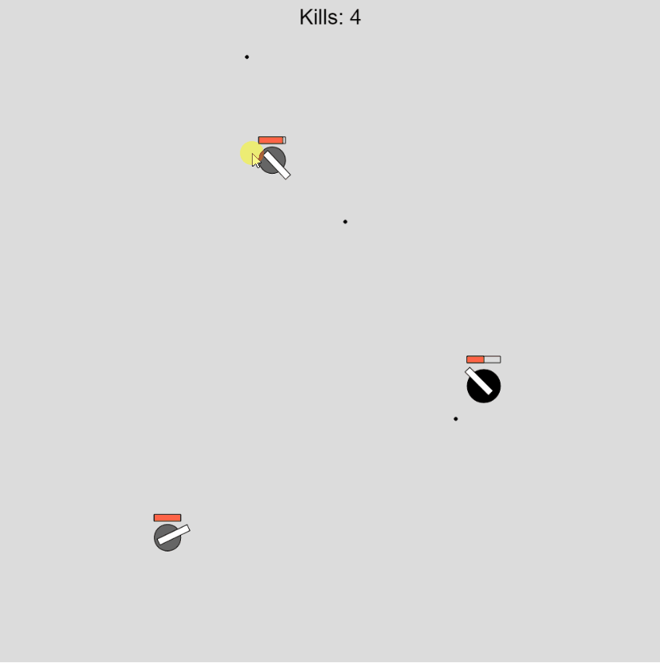

# MVP 2D Shooter
2D shooter game built with p5.js. 

## Motivation
I've been playing a lot of web games that I used to play a years back (i.e agar.io, doodle jump, subway surfers) because I've been recently been thinking a lot about using Reinforcement Learning/Neuro Evolution to learn how to play these games. 
I wanted to see how fast I could build a game environment that I could apply RL to. Here, I added the constraint of building this game in one sitting and under a few hours. It has a lot of features that could be added to improve the gameplay but I was suprised to learn how fast/easy it is to build the basic game mechanics for a shooting game like surviv.io.

## Gameplay
WASD to move and click to fire. 

